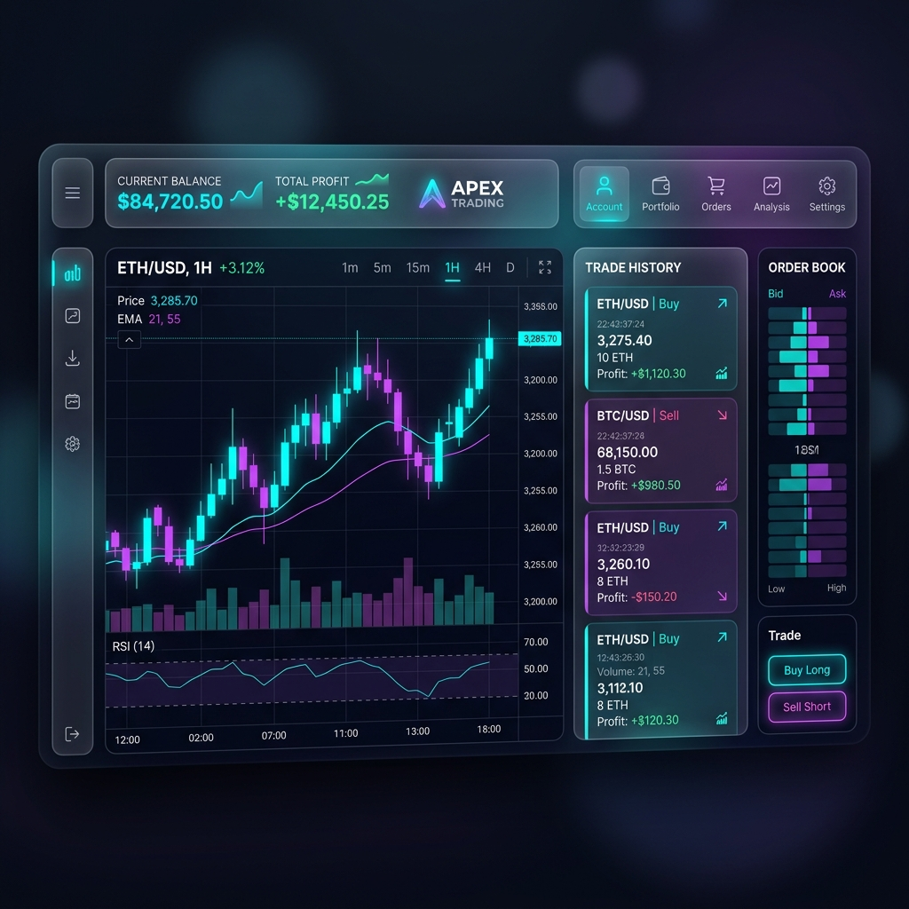

# Apex Trading HFT - Bot de Opciones Binarias



Este es un sistema de trading de alta frecuencia (HFT) diseñado para operar Opciones Binarias en la plataforma **Deriv/Binary.com**. El sistema utiliza una arquitectura asíncrona escalable y una estrategia de confluencia multitemporal avanzada.

## 🚀 Características Principales

- **Estrategia M15-M5-M1**: Análisis técnico en tres temporalidades para máxima precisión.
  - **M15**: Filtro de tendencia macro con EMA 200.
  - **M5**: Identificación de pullbacks con RSI y Bandas de Bollinger.
  - **M1**: Disparador de entrada mediante cruces de RSI.
- **Dashboard Visual**: Interfaz web elegante con estilo "Glassmorphism" para monitoreo en vivo.
- **Persistencia en PostgreSQL**: Almacenamiento profesional de todo el historial de operaciones.
- **Gestión de Riesgo**:
  - Stop Loss diario automatizado.
  - Sistema de Martingala controlada.
  - Stake fijo configurable.
- **Altamente Fiable**: Reconexión automática de WebSockets y lógica de heartbeat.

## 🛠️ Tecnologías Utilizadas

- **Lenguaje**: Python 3.12+
- **Lógica Asíncrona**: `asyncio`, `websockets`, `aiohttp`
- **Análisis de Datos**: `pandas`, `pandas_ta`
- **Base de Datos**: `PostgreSQL` (vía `asyncpg`)
- **Frontend**: HTML5, CSS3 (Glassmorphism), JavaScript (Lightweight Charts)

## 📋 Requisitos Previos

1.  Python instalado en el sistema.
2.  Cuenta en [Deriv.com](https://deriv.com).
3.  Un **API Token** de Deriv con permisos de "Lectura" y "Operar".
4.  (Opcional) Instancia de PostgreSQL para persistencia de datos.

## ⚙️ Configuración e Instalación

1.  Clona el repositorio:
    ```bash
    git clone https://github.com/Akon2k/hft-binary-bot.git
    cd hft-binary-bot
    ```

2.  Crea e instala el entorno virtual:
    ```bash
    python -m venv venv
    source venv/bin/activate  # En Linux/Mac
    pip install -r requirements.txt
    ```

3.  Configura tus credenciales en el archivo `.env`:
    ```env
    DERIV_TOKEN=tu_token_aqui
    DB_USER=tu_usuario
    DB_PASSWORD=tu_password
    ...
    ```

## 🖥️ Uso

Para iniciar el sistema, simplemente ejecuta:

```bash
python main.py
```

Una vez iniciado, abre tu navegador en:
👉 **http://localhost:8080**

## ⚠️ Descargo de Responsabilidad (Disclaimer)

Este software es para fines educativos y de investigación. El trading de opciones binarias conlleva un alto nivel de riesgo y puede no ser adecuado para todos los inversores. **Nunca operes con dinero que no puedas permitirte perder.** El autor no se hace responsable de las pérdidas financieras incurridas por el uso de este bot.

---
Desarrollado con ❤️ por Iván Carmona (icarmona)
